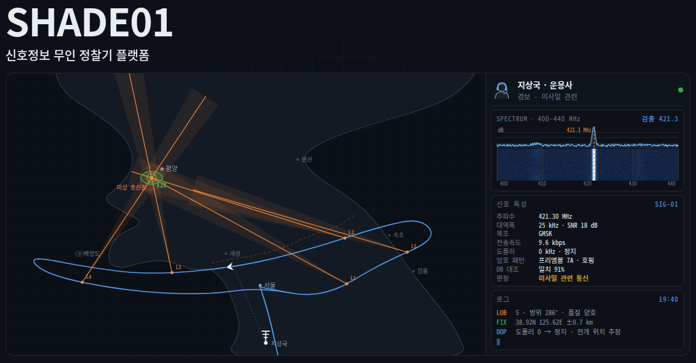

# SHADE01

**체계 소개 → [shade01.bewe.co.kr/intro](https://shade01.bewe.co.kr/intro)**

수직이륙 고정익(VTOL) 기체를 조립해 운용하며, 매 비행의 로그를 수집·분석하고 기록합니다.

| | |
|---|---|
| 기체 | Striver Mini VTOL 4+1 (익폭 2.1m, 7kg) |
| 비행 제어 | PX4 · Pixhawk 6C Mini |
| 기록 | 8일간 55회 비행, 누적 84분 |

---

## 1. 비행 기록을 업로드 하여 자동으로 분석이 이루어집니다

명령 한 줄로 기체 메모리의 로그를 수집합니다. 실비행만 선별하고 지상 시동은 제외합니다.

비행별 최고 고도·최대 속도·비행 시간·최대 전류를 표시합니다. 위험 수준의 전류는 붉게 표시됩니다.

---

## 2. 비행 기록을 재생하여 시간대별 분석이 가능합니다

비행 경로를 지도에 표시하고 그래프와 함께 재생합니다.

고도·속도·전류·자세·진동을 겹쳐 특정 시점의 원인을 추적합니다.

---

## 3. 비행 중인 기체의 상태를 실시간으로 분석합니다

계기판이 실시간으로 갱신됩니다. 고도·속도·배터리·위성 수를 브라우저에서 확인합니다.

수신 전용입니다. 기체로 명령을 보내는 경로는 구현하지 않았습니다.

---

## 4. 비행 전 기체를 점검합니다

명령 한 줄로 기체 상태를 조회해 비행 가능 여부를 판단합니다.

GPS·배터리·failsafe 설정·센서 상태를 확인하고, 이 기체의 기존 이력(전류 과다, 나침반 간섭)을 함께 표시합니다.

---

## 저장소 구성

| 폴더 | 내용 |
|---|---|
| `flights/` | 비행별 분석 기록 |
| `components/` | 부품별 제원과 배선 |
| `airframes/` | 기체 조립 구성 |
| `tools/` | 로그 수집·분석 프로그램 |
| `tools/fc/` | **FC 에 `extras.txt` 올리기·재부팅·ELRS Hz 재기** — [올리는 절차](tools/fc/README.md) · [재는 절차](tools/fc/MEASURING.md) |
| `web/` | 비행 기록 웹 서비스 |
| `docs/emergency/` | **현장 체크리스트** — 이륙 전 · 이륙 직후 · 비상 |
| `FC_CHANGELOG.md` | FC 변경 이력 |
| `OPERATIONS.md` | **운용 상세** — 기체 식별 · 링크 구성 · 현재 상태 · 다음 비행 전 |

FC 값 변경은 근거와 함께 기록합니다.
