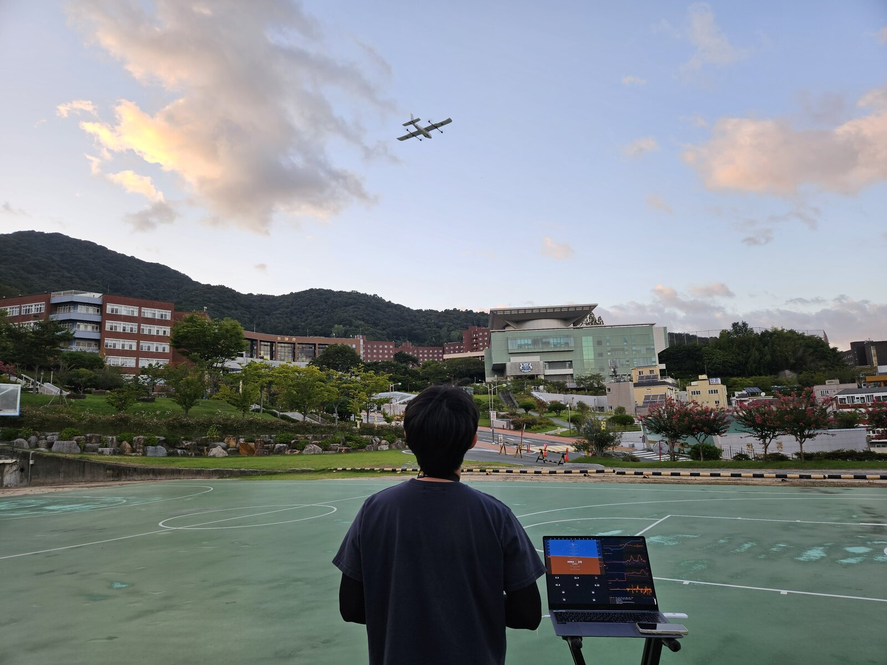
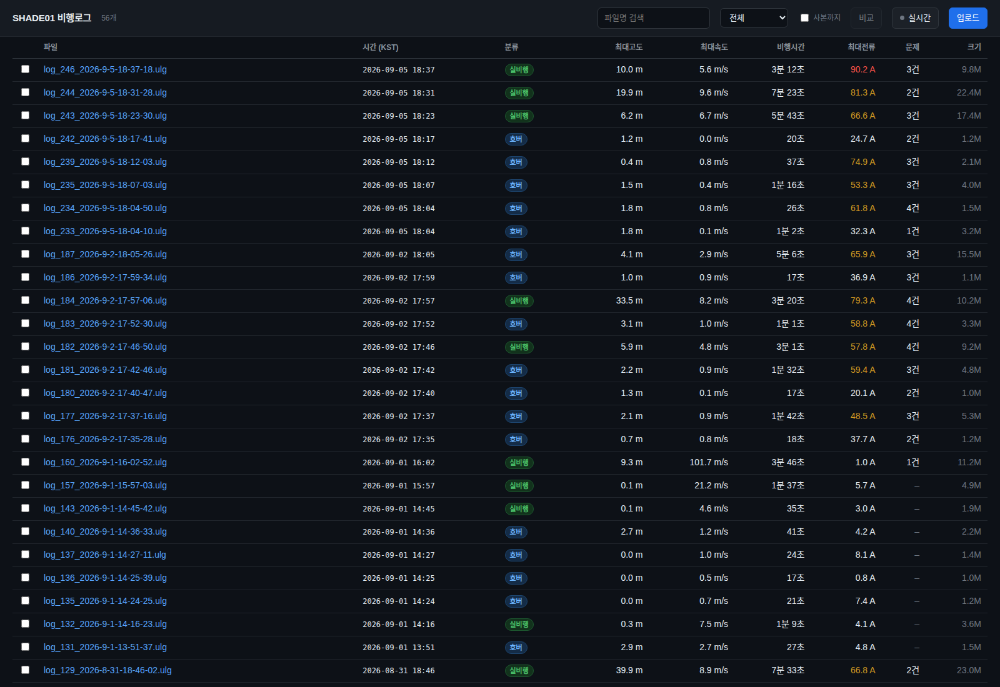
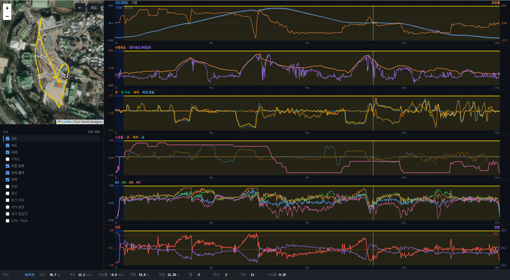
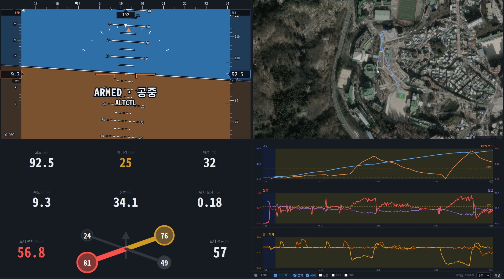
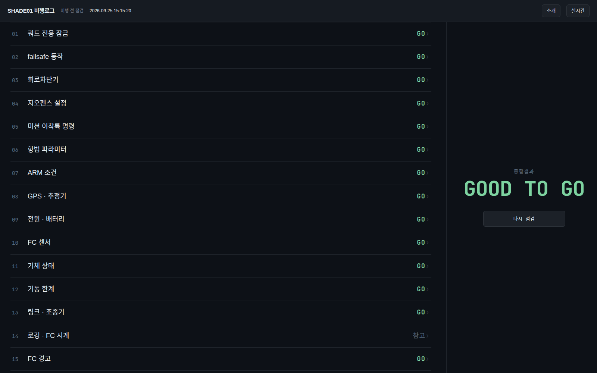

# SHADE01

**VTOL 드론 한 대를 실제로 운용하면서 만든 기록과 도구.**



수직이륙 고정익(VTOL) 기체를 직접 조립해 날리고, 매 비행의 로그를 받아 분석하고,
문제를 찾아 고친 과정이 전부 이 저장소에 있습니다.
비행 하나가 끝날 때마다 무엇이 잘못됐는지 숫자로 확인하고 다음 비행 전에 손봅니다.

*위 사진의 노트북 화면이 아래 3번 실시간 계기판입니다 — 날리면서 저 화면을 봅니다.*

| | |
|---|---|
| 기체 | Striver Mini VTOL 4+1 (익폭 2.1m, 7kg) |
| 비행 제어 | PX4 · Pixhawk 6C Mini |
| 기록 | 8일간 55회 비행, 누적 84분 |

---

## 1. 비행 기록이 웹에 쌓입니다

날리고 나서 명령 한 줄이면 기체 메모리의 로그가 자동으로 올라갑니다.
실제로 뜬 비행만 골라 올리고, 시동만 걸었다 끈 것은 걸러냅니다.



비행마다 **최고 고도·최대 속도·비행 시간·최대 전류**가 한 줄로 보입니다.
전류가 위험 수준이면 빨간색으로 뜹니다 — 위 목록의 `90.2 A` 가 그 예입니다.

---

## 2. 비행을 지도 위에서 되감아 봅니다

로그를 열면 실제 비행 경로가 지도에 그려지고, 그래프와 함께 재생됩니다.
"이 순간에 무슨 일이 있었나" 를 시간축을 옮겨가며 확인합니다.



고도·속도·전류·자세·진동을 겹쳐 보면서 원인을 찾습니다.
위 화면은 7분 33초 동안 날린 비행입니다 — 최고 39.9m 까지 올라갔고,
배터리 전압이 비행 내내 어떻게 떨어졌는지 아래 그래프에 그대로 나옵니다.

---

## 3. 날고 있는 기체를 실시간으로 봅니다

비행 중에는 계기판이 실시간으로 움직입니다.
고도·속도·배터리·위성 개수가 브라우저에 그대로 뜹니다.



**보기만 하고 아무것도 보내지 않습니다.** 실수로 기체에 명령이 나갈 수 없게
아예 그런 코드를 넣지 않았습니다.

---

## 4. 날리기 전에 기체 상태를 확인합니다

명령 한 줄로 기체에 물어봐서 **날려도 되는지** 판단합니다.



GPS·배터리·통신 두절 대비 설정·센서 상태를 한 번에 읽고
문제가 있으면 무엇이 문제인지 사람 말로 알려줍니다.
이 기체에서 실제로 겪은 사고들(전류 과다, 나침반 간섭)은 매번 같이 띄웁니다.

---

## 이렇게 씁니다

```
날리기 전   →  상태 확인, 날려도 되는지 판단
날리는 중   →  실시간 계기판
날린 직후   →  로그 자동 업로드
분석        →  지도 + 그래프로 원인 추적
기록        →  무엇을 왜 바꿨는지 남긴다
```

---

## 실제로 찾아낸 문제들

기록이 쌓이니까 눈으로는 안 보이던 것들이 보였습니다.

**커넥터가 감당 못 하는 전류를 쓰고 있었다**
비행 로그를 훑어보니 최대 90A 가 흐르고 있었습니다.
쓰고 있는 커넥터 정격의 2배입니다. 착륙 후 만져보면 뜨겁습니다.

**나침반이 모터 전류에 끌려다녔다**
기체가 자꾸 한쪽으로 흐르는데 원인을 몰랐습니다.
전류와 자기장 데이터를 겹쳐 보니 거의 완벽한 반비례 관계였습니다.
전선이 나침반을 흔들고 있었습니다.

**로그의 90%가 조용히 버려지고 있었다**
7분 33초 날린 비행이 27초로만 기록됐습니다.
분석 프로그램이 깨진 데이터 한 조각을 만나면 거기서 멈춰버리는 문제였습니다.
고치고 나니 같은 파일에서 453초가 전부 나왔습니다.

**같은 로그를 받을 때마다 내용이 달랐다**
같은 파일을 여러 번 받았는데 매번 달랐습니다. 처음에는 메모리 카드를 의심했는데,
다시 재 보니 **기체가 읽은 값은 매번 같았고** 전송 과정에서 깨지고 있었습니다.
여러 번 받아 다수결로 원본을 복원하는 방법으로 우회했습니다.

---

## 저장소 구성

| 폴더 | 내용 |
|---|---|
| `flights/` | 비행별 분석 기록 — 무엇이 문제였고 어떻게 고쳤는지 |
| `components/` | 부품별 제원과 배선 (모터, 배터리, 수신기 등) |
| `airframes/` | 기체 조립 구성 |
| `tools/` | 로그 수집·분석 프로그램 |
| `web/` | 비행 기록 웹 서비스 |
| `docs/emergency/` | **현장 체크리스트** — 이륙 전 · 이륙 직후 · 비상. 종이로 들고 나가는 것 |
| `FC_CHANGELOG.md` | 기체 설정을 언제 왜 바꿨는지 전부 기록 |

기체 설정을 하나라도 바꾸면 **왜 바꿨는지 근거와 함께** 남깁니다.
나중에 문제가 생겼을 때 언제부터 그랬는지 되짚을 수 있어야 하기 때문입니다.

---

# 이하 운용 상세

## 링크 구성 — **3 경로**

지상국 링크는 **둘 남았다.** raspb1 은 **쇼트로 사망**(2026-09-10 확정)했고, `rim3` USB 직결이 지상 주 경로, ELRS 백팩이 비행 링크다. **공중 노드(기체 탑재 컴패니언)는 없다.**

| # | 경로 | 상태 | 쓰는 때 |
|---|---|---|---|
| 1 | ~~**raspb1 브리지** (기체 탑재 Pi)~~ | 🔴 **사망** — 쇼트 (2026-09-10 확정, 9/4 부터 offline 이었다) | 없음. 원격 텔레메트리가 필요해지면 **새 컴패니언을 장착해야 한다** |
| 2 | **PC USB 직결 브리지** (현재 `rim3`) | ✅ **가동중** | 지상 정비·파라미터·펌웨어 |
| 3 | **ELRS 백팩** (조종기 WiFi AP) | ✅ **비행 중 현행 링크** (WiFi 있는 PC 만) | 비행. 트래커가 USB 와 동시에 듣다가 USB 가 빠지면 이쪽으로 넘어간다 |

**FC USB 는 하나뿐이다.** 1 번과 2 번은 같은 포트를 두고 다투므로 **동시에 못 쓴다** —
한쪽을 쓰려면 다른 쪽 USB 를 물리적으로 뽑아야 한다. 3 번은 TELEM1 로 들어와 독립이지만,
노트북 WiFi 가 하나뿐이라 **백팩 AP 에 붙는 동안은 Tailscale 이 끊겨 1·2 번이 죽는다.**
셋 다 실질적으로 배타적이다.

### 1. raspb1 브리지 — 🔴 사망 (2026-09-10)

> 🔴 **raspb1 이 쇼트로 죽었다.** 9/4 부터 offline 이던 것이 하드웨어 사망으로 확정됐다.
> 이 절은 **기록**이다 — 되살릴 수 없다. 이 Pi 는 BEWE DGS-3 지상 기지도 겸했으므로
> **DGS-3 기지·드론 데이터링크·공중 노드가 전부 불가**다. 기체 탑재 컴패니언이 다시
> 필요하면 새 보드로 [컴패니언 문서](components/companion/raspberry-pi-5/README.md)의
> 구성을 재현한다. 아래 수치는 8/31 실측이다.

```
[Pixhawk 6C Mini] ──USB-C ⟷ USB-A── [Raspberry Pi 5 "raspb1"]   ← 지금 USB 뽑힘
                                          /dev/ttyACM0
                                       mav_bridge.py (UDP :14550)
                                     WiFi/LTE → Tailscale → QGC 4대
```

| 항목 | 값 |
|---|---|
| FC ↔ Pi | **USB 직결** `/dev/ttyACM0` — Pi 시리얼 읽기 **21.0 KB/s** 실측 |
| Pi ↔ GCS | UDP 14550 over Tailscale — GCS 수신 **21.8 KB/s** 실측 |
| 브리지 | `mavlink-bridge.service` (`enabled`, `Restart=always`) |

- 🔴 **사망 (2026-09-10 확정)** — 9/4 에 FC USB 를 `rim3` 로 옮긴 뒤 offline 이었고, 쇼트로
  죽은 것이 확인됐다. **9/5 야외 3편이 raspb1 없이 ELRS 백팩으로 날았다** — 비행 링크는
  백팩이고 컴패니언은 필수가 아니다. 백팩 사거리를 넘는 원격 텔레메트리는 **새 보드를 달기
  전까지 없다.**
- ⛔ **TELEM2 는 죽었다** (2026-08-31). 포트 전원까지 사망 —
  [근거](components/companion/raspberry-pi-5/README.md#-telem2-포트-사망--usb-링크로-전환-2026-08-31)
- ✅ **WiFi + LTE 이중화** (2026-08-31) — LTE 모뎀 장착으로 WiFi 범위 의존이 해소됐다.
  ⚠️ 비행 중 링크 신뢰성은 아직 장거리로 검증되지 않았다.

### 2. PC USB 직결 브리지 — ✅ 현재 가동중 (`rim3`)

raspb1 이 하던 일을 PC 가 대신한다. 같은 `mav_bridge.py` 이고, 중계 대상도 같은 4 대다.

```
[Pixhawk 6C Mini] ──USB── [rim3]  /dev/ttyACM0
                          mav_bridge.py (UDP :14550, Tailscale 주소에만 바인딩)
                                  │
        ┌──────────────┬──────────┴───┬──────────────┐
        ▼              ▼              ▼              ▼
     ku-dgs1          rim           rim3       gram-labtop      ← QGC 4대
  100.99.120.110  100.107.83.47  100.117.47.105  100.66.204.25
```

```bash
cd ~/SHADE01 && ./shade-bridge/pc_bridge.sh
```

**2026-09-04 실측 (`rim3` 직결, `ku` 에서 수신):**

| 항목 | 값 |
|---|---|
| 수신 대역 | **28.4 KB/s** — raspb1 의 21.8 KB/s 보다 빠르다 (유선 Tailscale) |
| 하행 | ✅ FC sysid 1 — `ATTITUDE`·`HIGHRES_IMU`·`LOCAL_POSITION_NED` 정상 |
| 상행 | ✅ `PARAM_REQUEST_READ` → `PARAM_VALUE` 왕복 확인 |
| `rim` 레그 | ✅ rim3→rim tx 17.95 MB vs rim3→ku 17.99 MB — 같은 스트림이 양쪽에 나감 |
| `gram` 레그 | 안 감 — gram 이 `offline` (정상 동작) |

- 🔴 **상행이 열려 있다 = ARM·모드변경·미션업로드가 원격에서 된다.** 브리지는 Tailscale
  주소에만 바인딩하고 송신자를 화이트리스트로 거른다 —
  [노출 범위](shade-bridge/README.md#노출-범위--반드시-읽어라)를 반드시 읽어라.
- ⚠️ **`ku-dgs1` 에서 브리지를 돌릴 땐 `MAV_BIND` 를 명시한다.** 공인 IP
  (`203.253.176.74`)가 있고 `ufw` 도 꺼져 있어, Tailscale 자동탐지가 실패하면 인터넷에서
  FC 로 명령이 들어온다.
- ✅ **자동 재시작 (2026-09-04)** — `shade-bridge.service` (`Restart=always`) 로 돌린다.
  `kill -9` 후 3초 만에 복구되는 것을 실측했다. 그전에는 손으로 띄운 프로세스였다 —
  그 탓에 서비스 쪽은 포트 충돌로 634 회 재시작하다 죽어 있었다
  ([상세](shade-bridge/README.md#-손으로-띄우면-서비스가-조용히-죽는다)).

### 3. ELRS 백팩 링크 — 조종기 WiFi

조종기(RadioMaster Boxer) 의 백팩이 AP 를 띄우고, PC 가 거기 붙어 `10.0.0.1:14550` 으로
받는다. FC 쪽은 **TELEM1** 이라 1·2 번과 독립이다. QGC 링크는 로컬 리슨 **14555**.

| PC | WiFi 장치 | 백팩 링크 |
|---|---|---|
| `rim3` | `wlo1` | ✅ |
| `gram-labtop` | `wlp0s20f3` | ✅ |
| `ku-dgs1` | **없음** (유선 `enp3s0`) | ❌ USB 동글 필요 |

```bash
./gcs/qgroundcontrol/elrs-backpack        # AP 전환 → QGC → 닫으면 원래 WiFi 복귀
./qgc live on                             # 실시간 트래킹 페이지 (읽기 전용, localhost:4400)
```

QGC 대신(또는 같이) **브라우저로 볼 수 있다** — 지도 한쪽, 계기 한쪽이다.
백팩·브리지 어느 경로든 같은 페이지가 뜬다: [`web/live/`](web/live/).

- ⚠️ **백팩 AP 에는 인터넷이 없다.** NetworkManager 가 30초~2분 뒤 원래 WiFi 로 라디오를
  뺏어간다 — 프로파일에 `autoconnect-priority 100` + `never-default yes` 가 있어야 한다.
- 백팩 FW **1.5.9**, Telemetry = **wifi**.

### RC 는 링크와 별개다

| 항목 | 값 |
|---|---|
| RC | MAVLink over ELRS → FC **TELEM1** (CRSF 아님) |

조종은 위 3 경로 중 무엇을 쓰든 **ELRS 무선으로 직접** 들어간다. 브리지가 죽어도
조종은 살아 있다 (반대로 브리지만 살고 RC 가 죽으면 `NAV_RCL_ACT=2` 로 RTL).

상세: [raspb1 브리지 구현](components/companion/raspberry-pi-5/README.md) ·
[PC 직결 브리지](shade-bridge/README.md) ·
[QGC 접속 절차 · 링크 3개 등록](gcs/qgroundcontrol/README.md#링크-3개-구성-2026-09-02-확정)

---

## 기체 식별

| 항목 | 값 |
|---|---|
| 기체 | [Striver Mini VTOL](airframes/striver-mini-vtol/README.md) (4+1), `MAV_TYPE=22` |
| FC | [Pixhawk 6C Mini](components/fc/holybro-pixhawk-6c-mini/README.md) — `PX4_FMU_V6C`, HW `V6C002002` |
| 펌웨어 | **PX4 v1.17.0 커스텀** (`d6f12ad1c4f7`, 2026-08-11 빌드, CRSF 포함, 플래시 98.3%) |
| 컴패니언 | 🔴 **없음** — [Raspberry Pi 5 `raspb1`](components/companion/raspberry-pi-5/README.md) 쇼트 사망 (2026-09-10 확정). FC USB 는 `rim3` |
| 조종기 | [RadioMaster Boxer](components/transmitters/radiomaster-boxer/README.md) (EdgeTX 2.12.1) |
| 수신기 | [RP4TD-M](components/receivers/radiomaster-rp4td-m/README.md) — TELEM1, 바인딩 완료 |
| 전원 | [PM08 DroneCAN](components/power/holybro-pm08-can/README.md) — `UAVCAN_ENABLE=2`, `BAT1_SOURCE=1` |
| 배터리 | [Fullymax 6S 16000mAh](components/batteries/fullymax-6s-16000mah/README.md) |
| 지상국 | **QGroundControl v5.1.4** (직접 빌드, VTOL 패치) — [빌드](gcs/qgroundcontrol/BUILD.md) · [설치 절차](gcs/qgroundcontrol/README.md#설치-ubuntu--실기-기준) |
| 저장소 | `github.com/6K5EUQ/SHADE01` — 클론: `ku`, `rim3` |
| 파라미터 백업 | [`params/`](params/) 최신 스냅샷 (1353개) · 미션·펜스는 [`config/*.plan`](config/) · TELEM1 스트림은 [`config/extras.txt`](config/extras.txt) · 9/2 구조 정리본 [`config/SETTINGS.md`](config/SETTINGS.md) (값 인용 금지) |

### ELRS

| 장치 | 펌웨어 | 설정 |
|---|---|---|
| TX (Boxer 내장) | Unified **4.1.0 커스텀** (DroneCAN 배터리 패치) | Link Mode = **MAVLink** |
| RX RP4TD-M | **3.5.6** (ee188b) ISM2G4 | Serial = **MAVLink**, Bound UID `45,5,9,157,112,199` |
| 백팩 | **1.5.9** | Telemetry = **wifi** |

**링크 설정 (2026-09-09 조종기 실측)** — `Packet Rate 333Hz Full` / `Telem Ratio 1:2` / **13211bps**

하향 텔레메트리 상한이 **1651 B/s** 다. 현재 `MAV_0_RATE=1400` 으로 그 **85%** 를 예산으로
잡고, 실제 송신은 **900~1080 B/s** (상한의 55~65%) 다. `txbuf` 100, `rate_multiplier` 1.000
— 지금은 깎이지 않는다.

⚠️ **옛 "250Hz / 615 B/s / 96% 포화" 서술은 무효다.** 그 값으로 대역폭을 병목이라
오진해 2026-09-05 에 `MAV_0_RATE` 를 300 으로 내렸다가 되돌린 일이 있다. 진짜 원인은
`MAV_0_FORWARD=1` 이었다 — [경위](FC_CHANGELOG.md#-2026-09-09--sensor-lost-원인-규명과-해결-mav_0_forward--extrastxt--mav_0_rate).

Telem Ratio 는 **1:2 가 이미 최대**다. 더 늘리려면 Packet Rate 를 500Hz 로 올려야 한다
(⚠️ 수신 거리는 줄어든다) — 지금 여유로는 필요 없다.

> **TX 는 커스텀 펌웨어다.** 공식 4.1.0 은 `BATTERY_STATUS.id != 0` 을 버려 조종기 화면에
> 배터리가 안 뜬다. 재플래시하면 바인딩도 다시 해야 한다 —
> [상세](components/transmitters/radiomaster-boxer/elrs-battery-telemetry-fix.md)

### 출력 배치 (2026-09-01 실측)

| 커넥터 | 기능 | PWM |
|---|---|---|
| MAIN1 / MAIN2 | **우 / 좌 에일러론** | **100Hz** |
| MAIN3 / MAIN4 | VTOL 우후 / 우전 | 400Hz |
| MAIN5 | UBEC 5.3V (신호 미사용) | — |
| MAIN6 / MAIN7 | VTOL 좌후 / 좌전 | 400Hz |
| MAIN8 | **크루즈 모터** | 400Hz |
| AUX1 / AUX3 | 엘리베이터 ×2 | — |
| AUX2 | 러더 | — |

서보를 MAIN1–2 한 타이머 그룹에 모아 **100Hz 로 분리**했다 (8/31 까지는 모터와 섞여
400Hz 였다). 상세·주의사항: [6C Mini 출력 배치](components/fc/holybro-pixhawk-6c-mini/README.md#-실기-배치-2026-09-01-fc-실측--확정)

### 조종기 스위치

| 스위치 | 채널 | 용도 |
|---|---|---|
| SA | CH5 | ARM |
| **SB (3단)** | **CH6** | **비행모드** — 위 STAB(1173) / 중간 ALT(1347) / 아래 POS(1520) |
| **SC + SF 래치** | **CH6 덮어쓰기** | SC위+SF → 988 = 슬롯1 **Mission** · SC아래+SF → 2011 = 슬롯6 **RTL** |
| SD | CH7 | ✅ **미매핑** (`RC_MAP_TRANS_SW=0`, 2026-09-04). 조종기에서는 움직이나 FC 가 무시한다 |
| SE | CH9 | KILL (`RC_MAP_KILL_SW=9`) |

⚠️ **P3(S3) 6단 로터리는 이 조종기에 없다.** 그렇게 적힌 옛 기록은 틀렸다 — CH6 은
SB(3단) + SC/SF 래치가 만든다. PWM 은 전부 2026-09-09 실측이다.

[상세·실측 PWM](components/transmitters/radiomaster-boxer/switch-mapping.md)

### 기체 세팅

- 모터 지오메트리: 좌전 CW / 우전 CCW / 좌후 CCW / 우후 CW + 크루즈(Forward). ESC 캘리브레이션 완료.
- 서보: 에일러론 **MAIN1/2**(위 출력 배치 표), 엘리베이터·러더는 AUX. **최종 기준은 FC 의 Actuators 설정.**
- ⚠️ 모터·서보는 **배터리 인가 시에만** 돈다 (USB 전원만으로는 안 돎).

---

## 현재 상태 (2026-09-10 — 실기 스냅샷 `params/px4_params_20260910-151002.params` 기준, 문서 217건 전수 대조)

| 항목 | 상태 |
|---|---|
| 링크 | ✅ 지상: `rim3` USB 직결 브리지 (ku·rim·gram 중계). **비행 중: ELRS 백팩** — 트래커가 USB·백팩을 동시에 듣고 USB 가 빠지면 2초 안에 백팩으로 넘어간다 ([상세](web/live/README.md#어디서-데이터를-받나)). 9/5 야외 3편이 이 구성으로 날았다. raspb1 은 🔴 **사망**(쇼트, 2026-09-10 확정) — 공중 노드 없음. 백팩 사거리 밖 텔레메트리 불가 |
| 비행모드 | ✅ **STAB / ALT / POS / MSN / RTL 6슬롯 전부 의도대로** (2026-09-09 실측·수정). `COM_FLTMODE1` 이 `4`(Hold)라 미션이 안 걸리던 것을 **`3`(Mission)으로 되돌렸다** ([경위](components/transmitters/radiomaster-boxer/switch-mapping.md#-슬롯1-이-mission-이-아니라-hold-로-걸린다-2026-09-09)) |
| ✅ 슬롯 여유 | 2026-09-09 실측 988/1173/1347/1520/2011 — **가장 좁은 곳도 63us**. 옛 "2단 7us" 경고는 없는 P3 로터리 기준이라 무효였다. **CH6 RC 캘리브레이션은 여전히 금지** |
| ✅ 텔레메트리 | **"Sensor lost" 해결** (2026-09-09). 원인은 대역폭이 아니라 `MAV_0_FORWARD=1` — USB 브리지 트래픽 2736 B/s 가 조종기 링크로 넘어가고 있었다. `0` 으로 끄고 `MAV_0_RATE` 990→**1400**, `extras.txt` 로 TELEM1 스트림 재배분. 배터리 최대공백 **40.02s → 0.81s**, `BAD_DATA` **253 → 0** ([경위](FC_CHANGELOG.md#-2026-09-09--sensor-lost-원인-규명과-해결-mav_0_forward--extrastxt--mav_0_rate)) |
| GPS | ✅ 위성 21~32, fix 4, eph 0.15~0.23m (야외 실측) |
| 진동 | ✅ 평균 2.5 / 최대 5.0 (8/25 세션 8~10 대비 개선) |
| 미션 | ✅ `TAKEOFF`(22) → WP×4 → `LAND`(21), 경로 163.6m ([백업](config/)). `MIS_TAKEOFF_ALT=20` (9/5, 5→20) |
| 지오펜스 | ⛔ **꺼져 있다 — 의도한 것** (`GF_ACTION=0`, 거리 0, 2026-09-05 14:16). `2`(Hold) 는 조종권을 뺏는다. 거리 관리는 조종자 몫 |
| failsafe | ✅ RC 상실 → RTL (`NAV_RCL_ACT=2`, `COM_RCL_EXCEPT=0`, 1s) · 저전압 → RTL |
| RTL | ✅ `RTL_RETURN_ALT=20` / `RTL_DESCEND_ALT=10` (9/5 17:15 — 순항 5m 인데 60m 로 솟던 것을 내렸다). **실비행 미검증** |
| 🔴 전류 | 최대 **90.2A** (9/5), 443초 중 239.8초가 45A 초과, 한 편 평균 45.9A. XT90 연속정격 45A 의 2배 — 커넥터 교체 필요. ESC·모터가 6S 전용이라 **12S 전환은 불가** ([ESC](components/esc/mfe-esc-650-50a/README.md)) |
| 🟡 기압계 | GPS 대비 **−14m** 오차. 미션(홈 기준)엔 무관, GPS 없는 고도유지엔 영향 |
| ✅ `NAV_DLL_ACT` | `2`(RTL) — 2026-09-05 14:16. 데이터링크 두절 시 복귀 |
| ✅ 고정익 차단 | **쿼드 전용으로 제한했다** (2026-09-04). `RC_MAP_TRANS_SW` 7→**0** (FC 에 저장 완료) · `NAV_FORCE_VT=1` · `VT_ELEV_MC_LOCK=1` · 미션 이착륙은 `TAKEOFF`(22)/`LAND`(21) · 비행모드 6슬롯에 고정익 모드 없음 |
| ✅ CH9 | `RC_MAP_RETURN_SW=0` (9/4 — RTL 은 `COM_FLTMODE6` 슬롯으로). `RC_MAP_KILL_SW=9` 만 남았다 |

### 지오펜스는 홈 기준이다

`GF_MAX_HOR_DIST` 도 `RTL_*` 도 **arm 한 자리**(홈)가 원점이다. 이륙지점이 아니다.
보통 같지만, 현장에서 **arm 후 QGC 지도에서 홈 아이콘(H) 이 기체 위에 있는지** 확인한다.
어긋나 있으면 펜스·RTL·미션 상대고도가 전부 엉뚱한 기준으로 돈다.

## 🔴 고정익 사용 금지 — 쿼드 전용 (2026-09-04)

**이 기체는 당분간 멀티콥터(쿼드) 모드로만 운용한다.** 고정익 천이는 하지 않는다.
에어스피드가 정지 상태에서 −5 m/s 를 읽고 있어(`SENS_DPRES_OFF=-4.52`) 천이의 전제
조건이 안 갖춰졌다 — 고정익 구간에서 대기속도를 잘못 읽으면 실속으로 이어진다.

진입 경로 넷을 **전부 닫아 뒀다.** 하나라도 열려 있으면 의도치 않게 천이한다:

| 경로 | 상태 | 값 |
|---|---|---|
| 조종기 SD 스위치 | ✅ 닫힘 | `RC_MAP_TRANS_SW=0` (7 이었다, FC 저장 완료) |
| 미션 이착륙 | ✅ 닫힘 | `.plan`·FC 둘 다 `TAKEOFF`(22)/`LAND`(21) — 84/85 는 **전환을 건다**, 아래 참조 |
| 비행모드 슬롯 | ✅ 없음 | 6슬롯 = STAB / ALT / POS / POS / Mission / RTL |
| MC 제어면 | ✅ 잠김 | `VT_ELEV_MC_LOCK=1` |

🔴 **이 경고는 2026-09-05 에 뒤집혔다 — 방향이 반대였다.**
`VTOL_TAKEOFF`(84) 는 "수직 이륙" 이 아니라 **"수직으로 떠서 → 고정익으로 전환하라"** 다.
[mission.cpp:380](https://github.com/PX4/PX4-Autopilot/blob/d6f12ad1c4f7/src/modules/navigator/mission.cpp#L380) 이 상승 후
`set_vtol_transition_item(..., VEHICLE_VTOL_STATE_FW)` 를 부른다 — **스위치를 거치지 않으므로
`RC_MAP_TRANS_SW=0` 으로도 막히지 않는다.**

`NAV_FORCE_VT=1` 은 이 경로를 막지 못한다. `force_vtol()` 은
[navigator_main.cpp:1311](https://github.com/PX4/PX4-Autopilot/blob/d6f12ad1c4f7/src/modules/navigator/navigator_main.cpp#L1311)
에서 **기체가 이미 고정익일 때만** true 이기 때문이다.

**쿼드 전용인 동안은 `TAKEOFF`(22)·`LAND`(21) 여야 한다.** `.plan` 을 QGC 에서 다시 만들 때
VTOL 이착륙으로 저장되지 않도록 주의하라 — 고정익을 푼 뒤에 84/85 로 되돌린다.

**푸는 순서** — 아래 「다음 비행 전」 2번(에어스피드 영점)을 먼저 해결하고,
그 다음에 `RC_MAP_TRANS_SW` 를 되돌린다. 순서를 바꾸지 마라.

## 다음 비행 전

**천이 테스트는 위 「고정익 사용 금지」 를 푸는 절차를 거친 뒤에만.**

1. **기체 육안 점검** — 8/25 3m 낙하 이력. 프레임·모터 마운트·프롭.
2. **에어스피드 영점** — 정지 시 −4.7~−5.0 m/s, `SENS_DPRES_OFF=-4.52`. **배관은 정상**(불면 양수).
   무풍에서 영점만 재보정, ±2 이내 확인. **[고정익 금지](#-고정익-사용-금지--쿼드-전용-2026-09-04)를 푸는 전제 조건.**
3. **홈 위치 확인** — arm 후 QGC 지도에서 홈(H) 이 기체 위인지. 펜스·RTL 이 전부 홈 기준이다.
4. **RX failsafe 실측** — 조종기를 끄고 FC 가 RC 상실을 몇 초 만에 인지하는지 본다.
   ELRS RX 가 "마지막 값 유지" 로 설정돼 있으면 `NAV_RCL_ACT=2` 가 늦게 걸리거나 안 걸린다.
5. **기압계 −14m 오차** — GPS 대비. `EKF2_HGT_REF=1` 이라 GPS 없는 고도유지에 영향.
6. **자기 간섭 저감** — EKF `mag_field` **3축 전부** 이상. GPS 마스트 높이기, 전력선 이격·트위스트.
7. 🔴 **커넥터 교체** — 9/5 최대 **90.2A**, 443초 중 **239.8초**가 45A 초과.
   한 편은 **평균 45.9A** 로 정격 자체를 넘겼다. XT120/AS150. ([9/5 세션](flights/2026-09-05-outdoor-session.md#-1-전류가-지난-기록을-넘었다--902-a))
8. **지상테스트용 임시 파라미터 원복 확인** — `COM_DISARM_PRFLT`, `COM_PREARM_MODE`,
   `SYS_HAS_NUM_ASPD`. (`COM_ARM_WO_GPS=1` 은 Position·Mission 에서 자체 검사가 여전히
   막으므로 그대로 둬도 된다.)
9. 🔴 **배터리를 더 일찍 회수** — 9/5 에 누적 **12294 mAh**(77% DoD), 셀당 **3.61V**
   까지 갔다 (`BAT1_V_EMPTY=3.6` 바로 위). 누적 10000 mAh 를 넘으면 새 편을 시작하지 마라.
10. 🟡 **Kill 대신 정상 disarm** — 9/5 3편 전부 Kill 로 끝냈고 `Disarming denied: not landed`
    가 실제로 찍혔다. Kill 은 비상용이다.
11. ✅ ~~**SD 카드 교체**~~ — **필요 없다** (2026-09-09 정정). 카드는 같은 데이터를
    일관되게 내준다 — FC 가 낸 CRC 가 4회 전부 같았다. 손상은 **MAVFTP 전송**에서
    생긴다. 로그 손상 자체는 실재하므로 `--verify` 다수결은 계속 쓴다
    ([상세](FLIGHT-SYNC.md#-2026-09-09-정정--카드가-아니라-전송-경로다))

**해결됨** — `MAV_1_CONFIG` → 0, `COM_RC_LOSS_T` 1s, `NAV_DLL_ACT` 2, 미션 이착륙 22/21.
(지오펜스 150/50 과 RTL 25/10 은 9/2 에 넣었다가 9/5 에 각각 **해제**·**20/10** 으로 바꿨다 — [FC_CHANGELOG](FC_CHANGELOG.md))

## 이력

| 날짜 | 사건 |
|---|---|
| 2026-09-09 | ✅ **"Sensor lost" 해결 — 원인은 대역폭이 아니라 `MAV_0_FORWARD=1` 이었다.** TELEM1 송신 2868 B/s 중 **95%(2736)가 USB→TELEM1 포워딩**이고 스트림은 132 B/s 뿐이었다. USB 브리지를 붙일수록 조종기가 죽는 구조였다. 끄고 `MAV_0_RATE` 990→1400 + `extras.txt` 재배분 → 배터리 공백 **40.02s → 0.81s**, `BAD_DATA` **253 → 0** ([상세](FC_CHANGELOG.md#-2026-09-09--sensor-lost-원인-규명과-해결-mav_0_forward--extrastxt--mav_0_rate)) |
| 2026-09-09 | ✅ **조종기 화면에 `Eph`(GPS 정확도) 추가.** CRSF 센서 프레임에 칸이 없는 값을 ArduPilot passthrough(`0x5002`) 원시 프레임에서 파싱한다 — 펌웨어·바인딩 변경 없음 ([원리](components/transmitters/radiomaster-boxer/telemetry-screen.md#eph--crsf-센서에-없는-값을-원시-프레임에서-읽는다-2026-09-09)) |
| 2026-09-09 | ✅ **라이브 화면에서 수신 경로를 고정한다** (자동 → USB → ELRS). USB 가 붙어 있으면 ELRS 가 영영 안 보이던 것을 배지 클릭으로 전환. `shade01` 에서도 되고, 랩서버는 rim3 가 걸어 오는 push 의 **응답에 얹어** 전한다 — 인바운드 경로는 안 열었다 |
| 2026-09-09 | ✅ **배터리 온도를 HUD 좌측 하단에 표시** (`BATTERY_STATUS.temperature`). ESC·모터 온도와 셀별 전압은 **하드웨어가 없다** (실측: `ESC_STATUS` 0회, `DSHOT_TEL_CFG=0`, `voltages[]` 가 팩 전압 하나) |
| 2026-09-10 | 🔴 **raspb1 쇼트 사망 확정** — 9/4 부터 offline 이던 원인. 컴패니언·공중 노드 없음, BEWE DGS-3 기지도 불가. 같은 날 결정: **`rim` 은 원격 조작 안 한다 — 그 PC 에서 `git pull` 하는 수동 갱신만** |
| 2026-09-09 | ✅ **로그 손상의 원인 정정 — SD 카드가 아니라 MAVFTP 전송이다.** 매 회차 새 연결로 재니 FC 가 낸 CRC 는 4회 전부 같고 내려받은 바이트만 갈렸다. 9/6 진단은 한 연결에서 CRC 를 반복 호출해 생긴 착시였다(PX4 `_workCalcFileCRC32` 버퍼 재사용). **카드 교체 불필요** ([상세](FLIGHT-SYNC.md#-2026-09-09-정정--카드가-아니라-전송-경로다)) |
| 2026-09-06 | 🔴 **같은 로그를 받을 때마다 내용이 다름을 발견** — 512바이트 섹터 단위로 어긋난다. 로그의 "구독 섹션 유실"·"포맷 정의 유실"·깨진 float 이 전부 여기서 온다. `--verify` 다수결로 복원한다. ~~SD 교체 필요~~ → **원인은 9/9 에 전송 경로로 정정됐다** |
| 2026-09-06 | ✅ **`./qgc sync` — 비행 직후 한 줄로 FC → 웹.** 크기 게이트로 49개→10개(2.7배), 실비행·호버만 업로드 ([절차](FLIGHT-SYNC.md)) |
| 2026-09-05 | 🔴 **야외 3편 (16.3분) — 전류 90.2A 최고기록, 배터리 77% DoD.** 로그 49개를 `rim3` USB 로 회수해 서버 반영(117개). 전부 수동 조종이라 RTL 20m 는 미검증 ([상세](flights/2026-09-05-outdoor-session.md)) |
| 2026-09-05 | ✅ **미션 사전 검토 후 3개 적용** — `RTL_RETURN_ALT` 60→20, `RTL_DESCEND_ALT` 30→10, `MPC_THR_HOVER` 0.50→0.65 ([상세](flights/2026-09-05-mission-preflight-review.md)) |
| 2026-09-04 | ✅ **고정익 사용 중지 — 쿼드 전용으로 제한.** `RC_MAP_TRANS_SW` 7→0 을 FC 에 쓰고 저장했다. 천이 진입 경로 4곳을 점검해 전부 닫힌 것을 확인 |
| 2026-09-04 | 🟡 **raspb1 링크 잠정 중단** — FC USB 를 `rim3` 로 옮겼다. `rim3` 직결 브리지가 ku·rim 까지 중계되는 것을 양방향 실측 확인 (28.4 KB/s, 상행 PARAM 왕복). README 링크 구성을 **3 경로**(raspb1 / PC 직결 / ELRS 백팩)로 정정 — "raspb1 단독, 대체 경로 없다" 는 백팩 링크 구축(9/3) 이후 낡은 서술이었다 |
| 2026-09-04 | ~~"Sensor lost" 원인 규명 — ELRS 대역폭 96% 포화~~ ⚠️ **오진이었다.** 250Hz 전제가 틀렸고(실제 333Hz), 진짜 원인은 `MAV_0_FORWARD` 다 — 2026-09-09 항목 참조. `MAV_0_RATE` 0 → 490 은 이때 적용 |
| 2026-09-04 | 백팩 링크 로딩 지연 규명·완화 — `noInitialDownloadWhenFlying` ([상세](gcs/qgroundcontrol/README.md#-백팩-링크는-왜-로딩이-느린가-2026-09-04-규명)) |
| 2026-09-02 | 🔴 **CH7 천이가 실제로는 매핑돼 있음을 발견** (`RC_MAP_TRANS_SW=7`) — 문서 3곳이 "미매핑"으로 잘못 적고 있었다 |
| 2026-09-02 | 브리지 보안 수정 — Tailscale 주소에만 바인딩 + 송신자 화이트리스트 ([상세](shade-bridge/README.md#노출-범위--반드시-읽어라)) |
| 2026-09-02 | QGC v5.1.4 직접 빌드 — VTOL 미션시간·기종표시 버그 [패치](gcs/qgroundcontrol/BUILD.md) |
| 2026-09-02 | 지오펜스 설정(150/50 + 폴리곤 6각형), RTL 고도 25/10, `MAV_1_CONFIG`→0 |
| 2026-09-02 | 미션 정리 — 고도 5m 통일, Launch=이륙점, 착륙 0m. `.plan`·파라미터 스냅샷을 git 에 넣기 시작 |
| 2026-09-01 | 출력 배치 정비 — 크루즈 모터 복구, 서보 100Hz 분리, 엘리베이터 반전 |
| 2026-09-01 | 로그 파서 수정 — 21개 전부 100% 디코딩 (마지막 비행 27초→**453초**) |
| 2026-08-31 | 실비행 21회, 최장 **7.6분** ([기록](flights/2026-08-31-ground-tests.md)) |
| 2026-08-31 | 비행모드 S3 6단 전환, `COM_ARM_WO_GPS=1`, 미션 고도 5m, 저전압 RTL |
| 2026-08-31 | FC TELEM2 사망 → **USB 링크 전환** |
| 2026-08-30 | 컴패니언 Pi `raspb2`(고장, 제거) → `raspb1` |
| 2026-08-25 | 야외 세션 14회 ([기록](flights/2026-08-25-outdoor-session.md)) — 3m 낙하 이력 |
| 2026-08-24 | 옥외 비행 #94 ([기록](flights/2026-08-24-log94-outdoor-flight.md)) |
| 2026-08-22 | 첫 호버 #85 ([기록](flights/2026-08-22-log85-first-hover.md)) |
