# SHADE01

수직이륙 고정익(VTOL) 무인기를 조립해 직접 띄우고, 비행 데이터를 수집 · 분석 · 시각화하는
운용 체계까지 만든 저장소입니다.

**[shade01.bewe.co.kr](https://shade01.bewe.co.kr)** · **[3D 콕핏](https://shade01.bewe.co.kr/cockpit)** · **[체계 소개](https://shade01.bewe.co.kr/intro)**

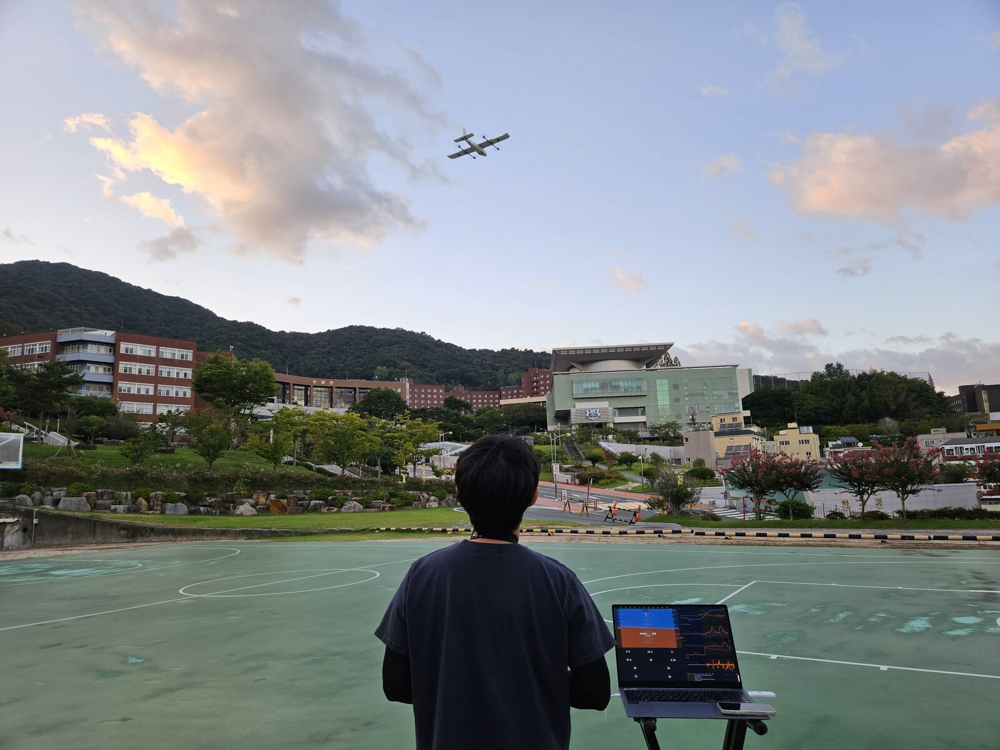

**10일간 83회 비행 · 누적 136.8분**

---

## 만든 것

| 영역 | 내용 | 기술 |
|---|---|---|
| 3D 콕핏 | 기체 자세 · 모터 부하 · 예측 경로를 위성 지도 위 3D 로 표시 | three.js, Blender Python 절차 모델링 |
| 비행 기록 분석 | 로그 업로드 → 자동 파싱 → 지도 · 그래프 재생 | Node.js, Python(PX4 ULog), Leaflet |
| 실시간 텔레메트리 | 비행 중 FC 상태를 웹으로 중계 | MAVLink, ELRS 백팩 |
| 비행 전 점검 | FC 를 읽어 항목별 GO / NO-GO 판정 (읽기 전용) | MAVLink, 스트리밍 응답 |
| 운영 인프라 | 자체 서버 배포, 여러 PC 에서 같은 FC 접근 | systemd, Cloudflare Tunnel, Tailscale |
| 기체 운용 | 자체 빌드 펌웨어, FC 변경 이력 관리, 현장 체크리스트 | PX4 v1.17.0 |

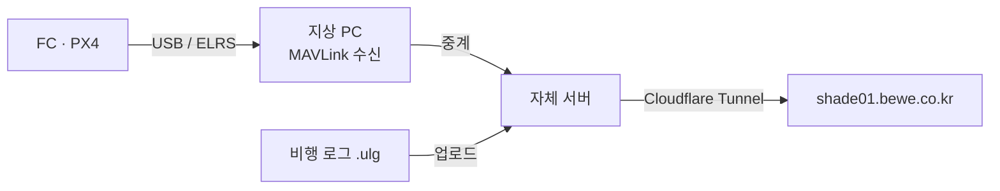
```mermaid
flowchart LR
  FC["FC · PX4"] -- "USB / ELRS" --> PC["지상 PC<br/>MAVLink 수신"]
  PC -- 중계 --> SV["자체 서버"]
  LOG["비행 로그 .ulg"] -- 업로드 --> SV
  SV -- "Cloudflare Tunnel" --> WEB["shade01.bewe.co.kr"]
```

---

## 1. 3D 콕핏

**→ [shade01.bewe.co.kr/cockpit](https://shade01.bewe.co.kr/cockpit)**

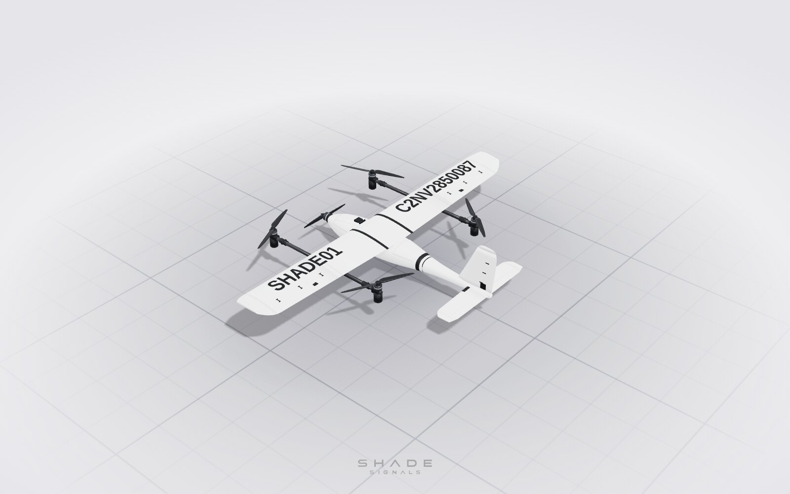

실시간이나 지난 비행 재생에서 기체 자세 · 모터 부하 · 예측 경로 · 홈 위치를 그립니다.
3D 모델은 실기 치수로 Blender 스크립트에서 생성합니다.

| 위성 지도 위 재생 | 모터 부하 · 예측 경로 · 홈 |
|---|---|
| 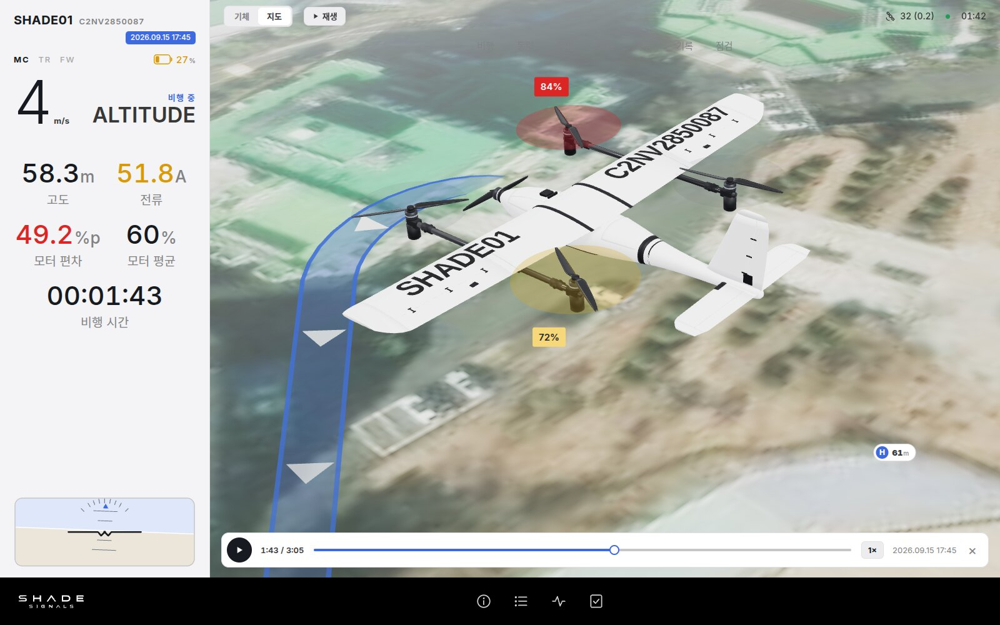 | 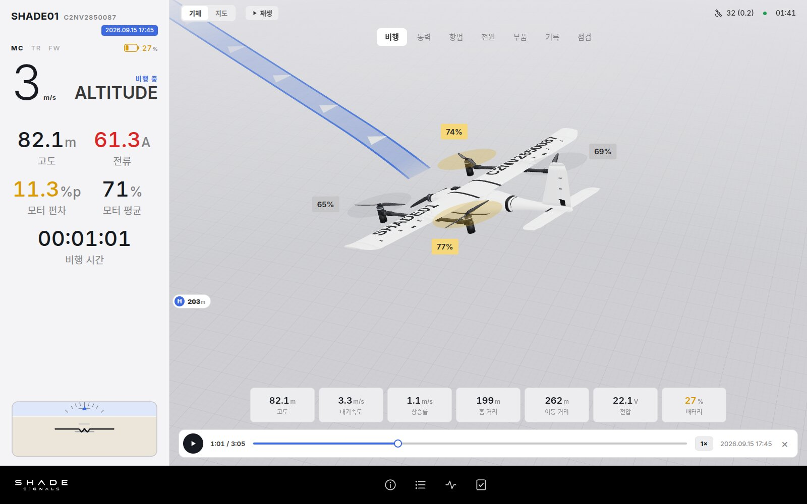 |
| **동력 계통 · 로터 회전 방향** | **동체 내부 부품** |
| 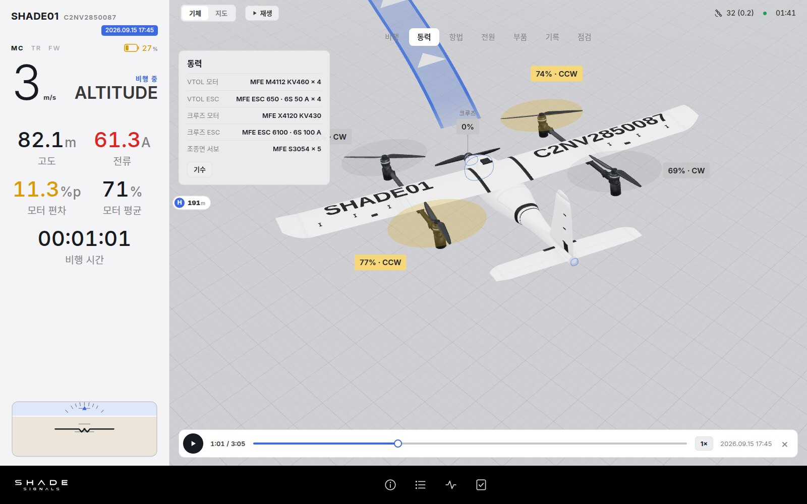 | 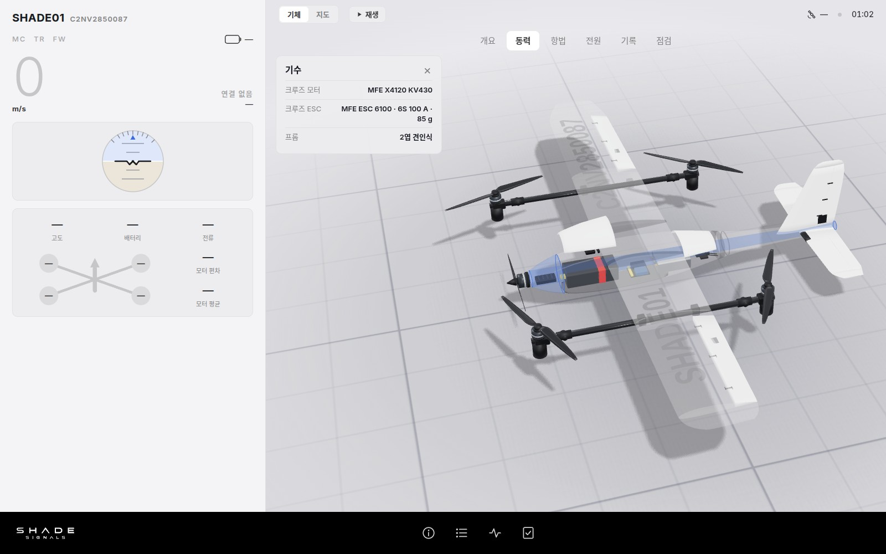 |

---

## 2. 비행 기록 분석

로그를 올리면 자동으로 파싱해 비행별 최고 고도 · 최대 속도 · 비행 시간 · 최대 전류를 표시합니다.
위험 수준의 전류는 붉게 표시됩니다.

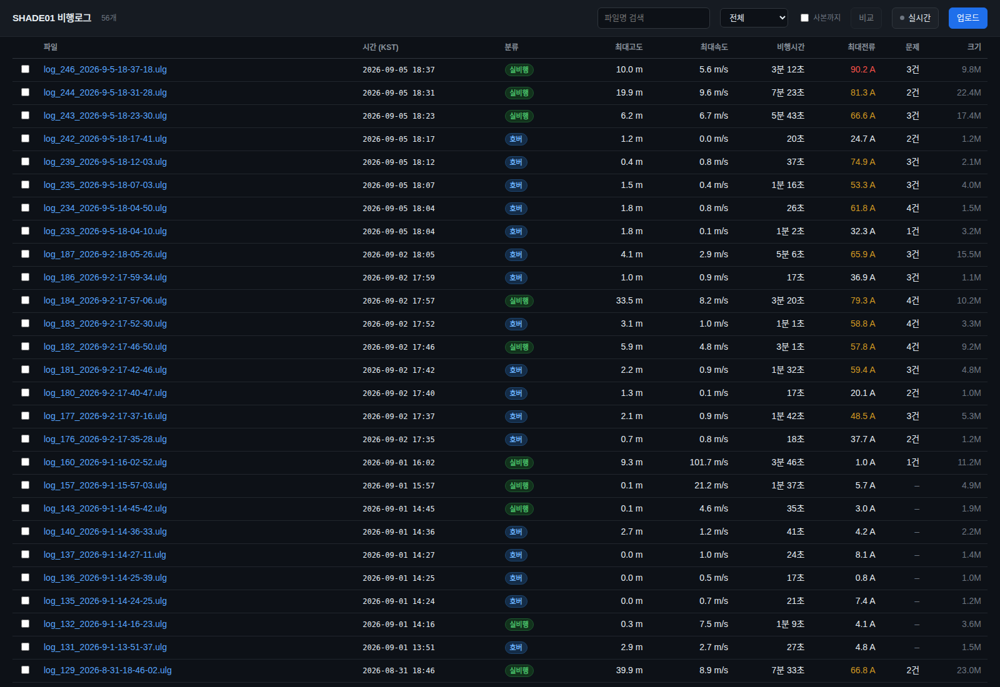

비행 경로를 지도에 그리고 그래프와 함께 재생합니다. 고도 · 속도 · 자세 · 조종 입력 · 모터 출력 ·
전력 · 진동 · 통신 · GPS 품질 · 센서 불일치를 겹쳐 특정 시점의 원인을 추적합니다.

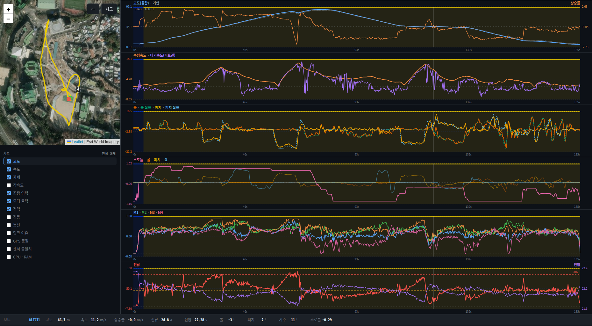

---

## 3. 실시간 텔레메트리

비행 중인 기체 상태를 계기판 · 지도 · 그래프로 봅니다.

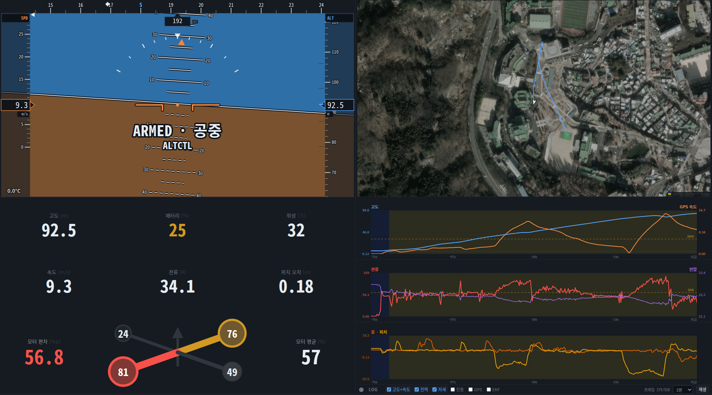

---

## 4. 비행 전 점검

FC 를 읽어 failsafe · 지오펜스 · GPS · 배터리 · 센서 상태를 확인하고 비행 가능 여부를 판정합니다.

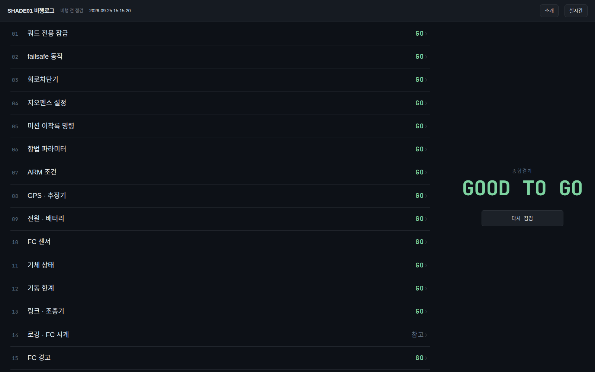

---

## 5. 체계 구상 — 신호정보 무인 정찰기

**→ [shade01.bewe.co.kr/intro](https://shade01.bewe.co.kr/intro)**

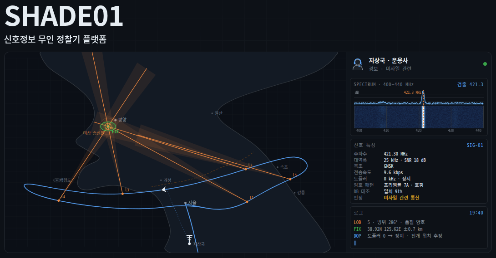

---

## 기체 제원

| 항목 | 내용 |
|---|---|
| 기체 | Makeflyeasy [Striver Mini VTOL 4+1](airframes/striver-mini-vtol/README.md) — 익폭 2100mm, 동체 1200mm |
| 중량 | 최대 이륙 6.98kg · 최대 탑재 1kg |
| 순항 | 18–21 m/s · 최대 이륙고도 3000m |
| VTOL 모터 | [MFE M4112 KV460](components/motors/mfe-m4112-kv460/README.md) ×4 |
| 크루즈 모터 | [MFE X4120 KV430](components/motors/mfe-x4120-kv430/README.md) ×1 |
| VTOL ESC | [MFE ESC 650](components/esc/mfe-esc-650-50a/README.md) 6S 50A ×4 |
| 크루즈 ESC | [MFE ESC 6100](components/esc/mfe-esc-6s-100a/README.md) 6S 100A ×1 |
| 서보 | [MFE S3054](components/servos/mfe-s3054/README.md) 디지털 풀메탈 ×5 |
| 비행 제어 | PX4 v1.17.0 · [Holybro Pixhawk 6C Mini](components/fc/holybro-pixhawk-6c-mini/README.md) |
| GPS | [Holybro M10N](components/gps/holybro-m10n/README.md) (GNSS + 컴퍼스) |
| 전원 | [Holybro PM08](components/power/holybro-pm08-can/README.md) DroneCAN |
| 배터리 | [Fullymax 6S 16000mAh](components/batteries/fullymax-6s-16000mah/README.md) 25C (XT90S) |
| 조종기 | [RadioMaster Boxer](components/transmitters/radiomaster-boxer/README.md) (EdgeTX) |
| 수신기 | [RadioMaster RP4TD-M](components/receivers/radiomaster-rp4td-m/README.md) — ELRS 2.4GHz |
| 신고번호 | C2NV2850087 |
| 보험 | 대인 무제한(2억원) · 대물 5억원 |

---

## 저장소 구성

| 폴더 | 내용 |
|---|---|
| `flights/` | 비행별 분석 기록 |
| `components/` | 부품별 제원과 배선 |
| `airframes/` | 기체 조립 구성 |
| `tools/` | 로그 수집·분석 프로그램 |
| `tools/fc/` | **FC 에 `extras.txt` 올리기·재부팅·ELRS Hz 재기** — [올리는 절차](tools/fc/README.md) · [재는 절차](tools/fc/MEASURING.md) |
| `web/` | 비행 기록 웹 서비스 |
| `docs/emergency/` | **현장 체크리스트** — 이륙 전 · 이륙 직후 · 비상 |
| `FC_CHANGELOG.md` | FC 변경 이력 |
| `OPERATIONS.md` | **운용 상세** — 기체 식별 · 링크 구성 · 현재 상태 · 다음 비행 전 |
