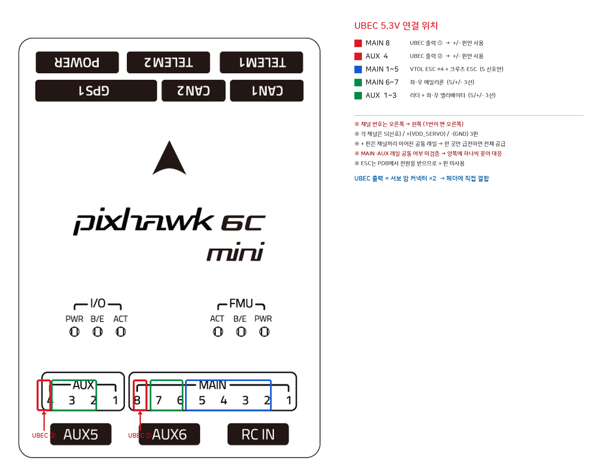

# Holybro Pixhawk 6C Mini — 비행제어기(FC)

Holybro의 소형 오토파일럿. [Striver Mini VTOL](../../../airframes/striver-mini-vtol/README.md)의 [FC 캐빈](../../../airframes/striver-mini-vtol/README.md#부위별-사진-자료)에 장착되는 비행 컨트롤러로, PNP 옵션에는 미포함이라 별도 구매한 부품.

- 제조사: Holybro
- 제품명: Pixhawk 6C Mini
- 공식 문서: https://docs.holybro.com/autopilot/pixhawk-6c-mini/overview
- 용도: PX4/ArduPilot 기반 비행 제어. VTOL/고정익 모드 전환, 모터/서보/센서 통합 제어
- 지원 펌웨어: PX4, ArduPilot (모두 오픈소스)

## 프로세서 / 센서

| 항목 | 값 |
|---|---|
| FMU 프로세서 | STM32H743, Arm Cortex-M7, 480MHz, 2MB 플래시, 1MB SRAM |
| IO 프로세서 | STM32F103, Arm Cortex-M3, 72MHz, 64KB SRAM |
| 가속도계/자이로 | ICM-42688-P, BMI088 (구형 BMI055는 단종) |
| 지자기 센서(Mag) | IST8310 |
| 기압계(Barometer) | MS5611 |

## 치수/무게

| 모델 | 치수 | 무게 |
|---|---|---|
| Model A (Legacy) | 53.3×39×16.2mm | 39.2g |
| Model A (Current) | 54.3×39×17.5mm | 42.4g |
| Model B | 58.3×39×18.15mm | 46.8g |

> 보유 기체에 실제 장착된 모델(A/B)은 실물 확인 필요.

## 전원 규격

| 항목 | 값 |
|---|---|
| 최대 입력 전압 | 6V |
| USB 전원 입력 | 4.75–5.25V |
| 서보 레일 입력 | 0–36V |
| Telem1+GPS1 출력 제한 전류 | 1.5A |
| 기타 전 포트 합산 제한 전류 | 1.5A |

## 커넥터 규격

| 포트군 | 커넥터 규격 |
|---|---|
| 대부분의 포트 | JST-GH, 1.25mm 피치 |
| FMU 디버그 포트 | JST-SH, 1mm 피치 |
| DSM RC 포트 | JST-ZH, 1.5mm 피치 |

## 주요 포트 핀아웃

| 포트 | 핀 수 | 비고 |
|---|---|---|
| Power1 | 6핀 | 1–2: VDD5V_BRICK1(in) / 3: CURRENT1 / 4: VOLTAGE1 / 5–6: GND |
| ~~Power2~~ | — | **없음** — 표준 Pixhawk 6C에는 있으나 Mini에는 미탑재 (전원 이중화 불가) |
| Telem1 / Telem2 | 각 6핀 | UART TX/RX + CTS/RTS + GND. Telem1=UART7, Telem2=UART5 |
| GPS1 | 10핀 | [Holybro M10N GPS](../../gps/holybro-m10n/README.md) 연결 포트. UART(TX1/RX1) + I2C(SCL1/SDA1) + SAFETY_SWITCH + SAFETY_SWITCH_LED + BUZZER- 통합 |
| GPS2 | 6핀 | 보조 GPS/컴퍼스용 (UART8 + I2C2) |
| I2C | 4핀 | VCC / I2C2_SCL / I2C2_SDA / GND |
| CAN1 / CAN2 | 각 4핀 | 1: VCC / 2: CAN*_H / 3: CAN*_L / 4: GND — **CAN1에 [PM08-CAN](../../power/holybro-pm08-can/README.md) 하나만** 연결(에어스피드는 I2C이므로 버스 공유 없음). CAN2 예비 |
| **MAIN OUT** (I/O PWM) | **8채널** | 각 채널 S/+/- 3핀. S=IO_CH1~8 |
| **AUX OUT** (FMU PWM) | **6채널** | 각 채널 S/+/- 3핀. S=FMU_CH1~6 |
| DSM RC | 3핀 | JST-ZH 1.5mm |
| PPM/SBUS(legacy) | 5핀 | |
| RSSI | 3핀 | |
| RC IN | 3핀 | S/+/- |

전체 핀아웃 원문: https://docs.holybro.com/autopilot/pixhawk-6c-mini/pixhawk-6c-mini-ports

### PWM 출력 (MAIN/AUX) 상세

| Pin | Signal | Voltage |
|---|---|---|
| S | IO_CH1~8 (MAIN) / FMU_CH1~6 (AUX) | **+3.3V** (5V with MOD) |
| + | **VDD_SERVO** | **0~36V** (외부 입력) |
| - | GND | GND |

**총 14채널 (MAIN 8 + AUX 6)** — 본 기체 소요 10채널(ESC 5 + 서보 5)에 4채널 여유.

#### 서보 레일 (VDD_SERVO)

- `+` 핀은 **FC가 전원을 공급하는 게 아니라 외부에서 받는 통로**다. FC 내부 5V 회로와 분리되어 있어 서보 부하 변동이 FC에 영향을 주지 않는다.
- **채널별로 독립된 전원이 아니라 하나의 공통 레일**이다. 근거: 표준 Pixhawk 6C의 PWM 커넥터 핀맵이 `1: VDD_Servo / 2~9: FMU_CH1~8 / 10: GND`로, **채널 8개에 전원 1핀·GND 1핀**만 배정된다(Holybro [Pixhawk 6C Ports](https://docs.holybro.com/autopilot/pixhawk-6c/pixhawk-6c-ports)). 6C Mini는 3핀 헤더 배열이지만 `+`/`-`가 전 채널 동일 신호명(VDD_SERVO/GND)이므로 동일 구조.
- 따라서 **UBEC 출력을 빈 채널 하나의 +/- 에 꽂으면 해당 포트군 전 채널에 전원이 공급**된다.
- ⚠️ MAIN 레일과 AUX 레일이 기판에서 공통인지는 미검증. [MFE UBEC](#서보-전원-mfe-ubec-연결)의 출력이 2가닥이므로 **MAIN·AUX에 하나씩 꽂으면 공통 여부와 무관하게 안전**하다.

#### ⚠️ PWM 신호 3.3V 문제

`S` 핀 출력이 **3.3V**다. 대부분의 ESC/서보는 인식하지만, [Emax ES3054 서보](../../servos/mfe-s3054/README.md)와 MFE ESC가 3.3V 신호로 정상 동작하는지 실물 검증 필요.

동작하지 않을 경우 Holybro 공식 해법 존재: **"The PWM Signal output of Main & AUX can be changed to 5V via a change of a resistor"** — 저항 1개 교체로 5V 출력 전환 가능 (핀아웃 표의 "5V with MOD"가 이것). 출처: Holybro [Pixhawk Baseboard v2 Ports](https://docs.holybro.com/autopilot/pixhawk-baseboards/pixhawk-baseboard-v2-ports)

### 서보 전원 (MFE UBEC) 연결

PNP 동봉 [MFE UBEC](../../../airframes/striver-mini-vtol/README.md#파워-시스템-power-system--pnp부터-포함)(3S~14S 입력, 5.3V/10A 출력)이 서보 5개 전원을 담당한다. FC의 Power1(FC 자체 전원, PM08 담당)과는 **완전히 별개 계통**이다.

```
PDB 300A [XT30] ──22V──► UBEC ──5.3V──┬─► FC MAIN OUT 빈 채널 (+/-)
                                       └─► FC AUX OUT 빈 채널 (+/-)
                                                    │
                                    MAIN CH1~8 / AUX CH1~6 전 채널 + 핀에 5.3V
                                                    │
                        서보 3선(S/+/-)을 채널에 꽂으면 신호·전원 동시 공급
```

- UBEC 입력선: 적/흑 18AWG 60cm, **커넥터 없는 맨선** → PDB XT30 연결용 **XT30 수 커넥터 납땜 필요**
- UBEC 출력선: 적/흑 2가닥 22AWG **15cm**, 끝에 **서보 암 커넥터** → FC PWM 헤더에 직접 꽂힘
- ⚠️ 출력선이 15cm로 짧음 — 배전 캐빈 ↔ FC 캐빈 거리에 따라 연장 필요
- ✅ **출력 5.3V 확정** (2026-08-04, 최신 4+1 구성표 `3S-14S UBEC 5.3V10A` 기재로 확인). MFE UBEC에 6V 사양 개체도 존재하나 본 기체 동봉품은 5.3V — 서보 정격 및 서보 레일(0~36V) 모두 문제 없음.

## Striver Mini VTOL 장착 시 연결 부품

| 연결 대상 | 포트 |
|---|---|
| [Holybro M10N GPS](../../gps/holybro-m10n/README.md) | GPS1 (10핀) |
| [Holybro Airspeed](../../sensors/holybro-airspeed-dronecan/README.md) | **I2C 포트 (4핀)** — ✅ 실물은 I2C 방식, 피토관 연결 후 정상 작동 확인 (2026-08-08). CAN 아님 |
| [Holybro PM08-CAN 파워모듈](../../power/holybro-pm08-can/README.md) | CAN1 (센싱) + Power1 (전원 입력) — ⚠️ 분기 케이블 필요, 아래 참조 |
| VTOL ESC ×4 ([MFE ESC 650](../../esc/mfe-esc-650-50a/README.md)) | MAIN OUT 또는 AUX OUT — 🔶 아래 참조 |
| 크루즈 ESC ([MFE ESC 6100](../../esc/mfe-esc-6s-100a/README.md)) | MAIN OUT 또는 AUX OUT — 🔶 아래 참조 |
| 서보 ×5 ([MFE 3054](../../servos/mfe-s3054/README.md)) | MAIN OUT 또는 AUX OUT — 🔶 아래 참조 |
| RC 수신기 ([RadioMaster RP4TD-M](../../receivers/radiomaster-rp4td-m/README.md)) | **Telem2** (UART, CRSF) — RC IN/SBUS 포트 불가. TX/RX 교차 배선, 배선표·파라미터는 [수신기 문서](../../receivers/radiomaster-rp4td-m/README.md#fc-연결-방법-pixhawk-6c-mini) 참조 |

### ⚠️ PM08-CAN 연결 시 제약 (2026-08-03 Holybro 공식 문서 확인)

1. **분기 케이블 필요** — PM08은 전원+CAN을 Molex CLIK-Mate 2.0mm **6핀 1개**로 통합 출력하나, 6C Mini는 **CAN1(JST-GH 4핀) + Power1(JST-GH 6핀)** 두 포트로 나눠 받는다. 커넥터 규격도 다르므로 무개조 연결 불가.
2. **FC 전원 이중화 불가** — 6C Mini에는 Power2가 없어 PM08의 5.2V 2계통 중 1개만 사용 가능.

상세: [PM08-CAN 문서의 FC 연결 섹션](../../power/holybro-pm08-can/README.md#fc-연결-pixhawk-6c-mini)

## 채널 배정안 (PX4 기준)

> ✅ **SHADE 기체는 PX4 확정** (2026-08-04)

소요 10채널(ESC 5 + 서보 5) < 보유 14채널. 아래는 **관례 기반 제안이며 확정이 아니다** — PX4에서 VTOL 에어프레임(`SYS_AUTOSTART`, Standard VTOL 계열)을 선택하면 채널 순서가 정해지고, PX4 v1.13+ 는 QGC **Actuators** 화면에서 채널을 자유 배정할 수 있으므로 최종 매핑은 QGC 화면 기준으로 맞춘다.

| 헤더 | 채널 | 기능 | 사용 핀 | 원문(Pixsurvey V3) 대응 |
|---|---|---|---|---|
| MAIN | 1 | VTOL 좌전방 | S, - | A3 |
| MAIN | 2 | VTOL 좌후방 | S, - | A2 |
| MAIN | 3 | VTOL 우전방 | S, - | A1 |
| MAIN | 4 | VTOL 우후방 | S, - | A4 |
| MAIN | 5 | 크루즈 모터 | S, - | M3 |
| MAIN | 6 | 좌 에일러론 | S, +, - | M1 |
| MAIN | 7 | 우 에일러론 | S, +, - | M5 |
| **MAIN** | **8** | **UBEC 5.3V 입력 ①** | **+, -** | — |
| AUX | 1 | 러더(수직꼬리) | S, +, - | M4 |
| AUX | 2 | 좌 엘리베이터 | S, +, - | M2 |
| AUX | 3 | 우 엘리베이터 | S, +, - | M6 |
| **AUX** | **4** | **UBEC 5.3V 입력 ②** | **+, -** | — |
| AUX5 / AUX6 | — | 예비 (낙하산 M7, 카메라 셔터 A5 등) | | |

- **ESC 5개는 `+` 핀 미사용** — 전력은 [PDB 300A](../../power/holybro-pdb-300a-side-entry/README.md)의 XT90에서 직접 받고, FC에서는 S(신호)와 -(GND 기준전위)만 쓴다. 따라서 MAIN 1~5에 ESC를 몰아두면 서보 레일 전류를 서보 5개만 소비하게 되어 부하 계산이 단순해진다.
- **서보 5개는 S/+/- 3선 전부 사용** — 신호는 FC, 전원은 서보 레일(UBEC)에서 나온다.



⚠️ **채널 번호는 오른쪽 → 왼쪽** (1번이 헤더 맨 오른쪽). 도면 [01-pinout-model-a-current.jpg](images/01-pinout-model-a-current.jpg) 참조. AUX는 헤더에 1~4만 있고 **AUX5·AUX6는 그 아래 독립 3핀 커넥터**로 분리되어 있다.

## QGC Actuators 화면 설정

PX4 v1.13+ 는 QGC **Vehicle Setup → Actuators** 화면에서 채널을 배정한다. 화면은 위에서부터 **Geometry**(기체 구조 정의) → **Actuator Outputs**(핀 배정) 순으로 구성되며, 아래는 Actuator Outputs 부분.

### 출력 그룹과 프로토콜/주파수

프로토콜·주파수 드롭다운은 **채널 개별이 아니라 그룹 단위**다. PX4 공식 문서 원문:

> "all the outputs in one group must operate under the same protocol at the same rate (e.g. PWM signal at 400Hz for all the outputs in one group)"

드롭다운 선택지: `DShot150` / `DShot300` / `DShot600` / `OneShot` / `PWM 50·100·200·400 Hz`.

| 컬럼 | 의미 |
|---|---|
| Function | 이 핀에 배정할 기능 (Motor 1~12, Servo 1~8, Parachute 등). 미사용은 `Disabled` |
| Disarmed | 시동 꺼진 상태에서 출력할 펄스폭(µs) |
| Minimum / Maximum | 출력 하한 / 상한 |
| Center (for Servos) | 양방향 액추에이터 중립점. `-1` = 미지정(Min/Max 중앙 자동) |
| Rev Range (for Servos) | 출력 방향 반전 — 배선 변경 없이 서보 회전 방향 전환 |

화면 상단 빨간 경고 **"One or more actuator still needs to be assigned to an output"** 은 Geometry에 정의된 기능 중 출력 미배정분이 남아 있다는 뜻이며, 이 상태로는 정상 동작하지 않는다.

### 🔴 SHADE 기체 적용 시 제약

1. **서보에 400Hz 금지** — PX4 문서 기준 *"Servos typically operate safely at lower PWM rates (50-100Hz)"*. [MFE 3054 서보](../../servos/mfe-s3054/README.md#기본-파라미터-basic-parameters) 스펙시트에는 **동작 주파수 항목 자체가 없어** 상한 판단 근거가 없으므로, 서보가 들어가는 그룹은 **`PWM 50 Hz`로 설정**한다.
2. **서보에 DShot/OneShot 금지** — PX4 문서: *"DShot and OneShot protocols are ESC-specific and incompatible with servos."*
3. **MAIN(IO) 출력은 DShot 불가** — DShot은 FMU 출력(=AUX)에서만 지원된다(PX4 [DShot](https://docs.px4.io/main/en/peripherals/dshot.html): *"DShot is only available on FMU outputs"*). 6C Mini는 IO 코프로세서(STM32F103)를 탑재해 MAIN 8채널이 IO 출력이므로, 위 배정안대로 **ESC 5개를 MAIN 1~5에 두면 DShot은 선택 불가**. 단 [MFE ESC 650](../../esc/mfe-esc-650-50a/README.md#튜닝-프로세스-throttle-travel-tuning)·[ESC 6100](../../esc/mfe-esc-6s-100a/README.md)은 비프음 기반 스로틀 캘리브레이션 방식의 **아날로그 ESC**라 PWM이 정상 선택지이며, 실질적 문제는 없다.
4. **UBEC 급전 채널(MAIN 8, AUX 4)은 `Disabled` 유지** — 신호선을 쓰지 않고 `+`/`-` 만 사용하는 급전 포트이므로 기능을 배정하지 않는다.
5. ⚠️ **AUX 7·8은 실물에 없다** — 하드웨어는 **AUX 6채널(FMU_CH1~6)**뿐이다(Holybro [6C Mini Ports](https://docs.holybro.com/autopilot/pixhawk-6c-mini/pixhawk-6c-mini-ports), PX4: *"14 PWM servo outputs (8 from IO, 6 from FMU)"*). QGC 화면에 `AUX 7-8` 그룹이 표시되더라도 **배정하면 출력이 나오지 않는다**.

### 설정 순서 (제안)

1. Geometry에서 VTOL 에어프레임 선택 후 모터 4개 + 크루즈 1개, 조종면 5개(에일러론 좌/우, 엘리베이터 좌/우, 러더) 정의 — 수평꼬리는 [좌우 독립 서보](../../../airframes/striver-mini-vtol/README.md#구조캐빈별-사양)이므로 엘리베이터를 2개로 잡는다
2. `PWM MAIN` 탭 — MAIN 1~5에 ESC 5개 배정, 프로토콜 **PWM**(DShot 불가), MAIN 8은 `Disabled`
3. `PWM AUX` 탭 — AUX 1~3에 서보 3개 배정, 그룹 주파수 **50Hz**, AUX 4는 `Disabled`
4. ESC Min/Max 확정 후 [ESC 스로틀 캘리브레이션](../../esc/mfe-esc-650-50a/README.md#튜닝-프로세스-throttle-travel-tuning) 수행 (⚠️ 프로펠러 제거 상태)
5. 상단 빨간 경고 소멸 확인

> 출처: PX4 [Actuator Configuration and Testing](https://docs.px4.io/main/en/config/actuators.html), [DShot](https://docs.px4.io/main/en/peripherals/dshot.html), [Pixhawk 6C Mini](https://docs.px4.io/main/en/flight_controller/pixhawk6c_mini.html), Holybro [Pixhawk 6C Mini Ports](https://docs.holybro.com/autopilot/pixhawk-6c-mini/pixhawk-6c-mini-ports) (2026-08-06 취득)

## 사진/자료

| 항목 | 파일 | 비고 |
|---|---|---|
| 핀아웃 도면 — Model A (Current) | [images/01-pinout-model-a-current.jpg](images/01-pinout-model-a-current.jpg) | 6면도. 포트 배치/채널 번호 순서 확인용 |
| 핀아웃 도면 — Model B | [images/02-pinout-model-b.jpg](images/02-pinout-model-b.jpg) | |
| 핀아웃 도면 — Model A (Legacy) | [images/03-pinout-model-a-legacy.jpg](images/03-pinout-model-a-legacy.jpg) | |
| 커넥터 Pin1 위치 도해 | [images/04-pin-number.png](images/04-pin-number.png) | JST-GH 핀 번호 기준 |
| **UBEC 연결 위치 표시** | [images/05-ubec-servo-rail-position.png](images/05-ubec-servo-rail-position.png) | 01번 도면에 주석 추가(자체 제작) |

> 출처: Holybro 공식 문서 [Pixhawk 6C Mini Ports](https://docs.holybro.com/autopilot/pixhawk-6c-mini/pixhawk-6c-mini-ports) (2026-08-04 취득)

## 🔶 확인 필요

- ~~펌웨어 PX4/ArduPilot 미확정~~ → **해소(2026-08-04): PX4 확정.** RP4TD-M CRSF 구동을 위해 `crsf_rc` 드라이버를 포함한 **커스텀 펌웨어 빌드가 필수 작업으로 확정**됨. 절차: [수신기 문서](../../receivers/radiomaster-rp4td-m/README.md#펌웨어별-설정)
- **PM08 6핀 커넥터의 핀 배열 미확보** — 분기 케이블 제작/구매 전 확인 필요. Power1의 CURRENT1/VOLTAGE1(아날로그 센싱 핀)을 미사용으로 두고 CAN 센싱만으로 동작하는지도 검증 필요.
- **PWM 신호 3.3V 호환성 미검증** — [Emax ES3054 서보](../../servos/mfe-s3054/README.md) 및 MFE ESC가 3.3V 신호로 동작하는지 실물 확인. 불가 시 저항 교체(MOD)로 5V 전환.
- **서보 PWM 주파수 상한 미확인** — [MFE 3054](../../servos/mfe-s3054/README.md#기본-파라미터-basic-parameters) 스펙시트에 동작 주파수(refresh rate) 항목이 없어 400Hz 허용 여부를 판단할 수 없다. [QGC Actuators 설정](#qgc-actuators-화면-설정)에서 **50Hz로 운용**하며, 제조사 문의 또는 실측으로 상한 확인 필요.
- **6C Mini의 타이머 그룹 경계 미확인** — 어느 채널끼리 타이머를 공유하는지가 Holybro·PX4 문서 어디에도 명시되어 있지 않다(PX4는 FMUv6C 레퍼런스 핀아웃 스프레드시트 참조로 안내). 현재 근거는 **QGC 화면 표시(AUX 1-4 / 5-6 / 7-8)뿐**. 서보(50Hz)와 ESC(PWM)를 같은 그룹에 섞지 않도록 실제 화면에서 그룹 경계를 확인한 뒤 배정할 것.
- **QGC가 표시하는 AUX 7·8** — 실물 하드웨어는 AUX 6채널(FMU_CH1~6)뿐인데 QGC 화면에는 `AUX 7-8` 그룹이 나타난다. 배정해도 출력이 없으므로 사용 금지. 화면 표시가 보드 정의/펌웨어 버전 때문인지 확인 필요.
- **MAIN 레일과 AUX 레일의 기판 내부 공통 여부 미검증** — UBEC 출력 2가닥을 양쪽에 하나씩 꽂아 회피 가능하나, 테스터 도통 확인이 확실.
- **신호선 길이** — FC 캐빈에서 꼬리 커넥터까지 50~70cm 추정. ESC/서보 기본 신호선(20~30cm)으로는 부족하므로 연장 케이블 다수 필요.
- **동체측 기존 배선 상태 확인** — PNP 기체이므로 날개/꼬리 커넥터 안쪽에서 서보 3핀 커넥터가 FC 캐빈까지 이미 나와 있을 가능성이 높음([기체 PDF p.13 FC 캐빈 사진](../../../airframes/striver-mini-vtol/images/10-flight-control-cabin.png)의 서보 케이블 다발). 나와 있다면 FC 헤더에 꽂기만 하면 되고, 없다면 D-sub 핀 직접 결선 필요.
- 원문 PDF 기반 [Striver 배선 다이어그램](../../../airframes/striver-mini-vtol/README.md#4-1-모드-배선-다이어그램-요약-참고용--pixsurvey-v3-fc-기준-pnp에는-fc-미포함)은 **Pixsurvey V3** FC 기준이므로 채널 배치(A1~A5, M1~M8)가 그대로 적용되지 않음. 위 [채널 배정안](#채널-배정안-px4-기준) 참조.
- 실제 장착 모델(A 레거시/A 현재/B) 확인 필요 — 치수/무게가 모델별로 다름. 위 도면 3종과 대조.

## 보유 수량 (SHADE 기체)

- 1개, PNP 옵션에는 미포함되어 별도 구매
